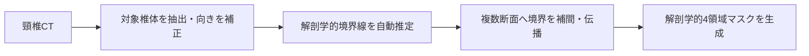
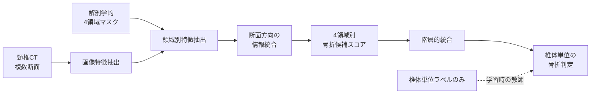

# 椎骨動脈損傷リスク評価に向けた頸椎の解剖学的領域別骨折検出AIの開発

## 坂口 裕也

---

## 研究背景

頸椎骨折では、骨折の有無だけでなく、**骨折がどの解剖学的部位に及んでいるか**が重要である。特に、椎骨動脈が走行する横突孔周辺への骨折波及は、椎骨動脈損傷リスクを考えるうえで重要な所見となる。

一方、既存の骨折検出AIの多くは、患者単位または椎体単位で「骨折あり／なし」を判定する。そのため、骨折の局在や、横突孔周辺への波及を直接的に提示することが難しい。

また、骨折位置を解剖学的領域ごとに付与する作業は専門家の負担が大きく、複数領域にまたがる骨折では正解領域を一意に決めにくい。

> **研究目的**  
> 頸椎を4つの解剖学的領域に分け、椎体単位の骨折ラベルのみを用いた弱ラベル学習によって、椎体全体の骨折判定と領域別の骨折候補提示を両立するAIを開発する。

---

## 提案手法

### 1. 頸椎の解剖学的4領域自動分割手法

頸椎CTから対象椎体を抽出し、椎体ごとの向きをそろえたうえで、解剖学的な境界線を自動推定する。推定した境界を複数断面へ補間・伝播し、椎体全体の4領域マスクを生成する。

生成する領域は以下の4つである。

- 椎体領域
- 右横突孔周辺領域
- 左横突孔周辺領域
- 後方要素領域

*公開頸椎CTに対する4領域分割例。椎体の複数断面に対し、解剖学的領域を一貫して分離する。*

### 2. 深層学習による解剖学的領域別の骨折検出法

各領域の正解ラベルは使用せず、**椎体全体の骨折あり／なし**だけを教師として学習する。モデルは、各断面・各領域から抽出した骨折の証拠を段階的に統合し、4領域別の骨折候補スコアと椎体全体の骨折判定を出力する。

本手法では、領域別出力を経由して椎体判定を行う。これにより、詳細な領域アノテーションがなくても、モデルが「どの断面・どの領域に骨折の証拠があるか」を学習できる。

---

<table>
<tr>
<td width="50%" valign="top">

<h2>実験結果</h2>

<strong>弱ラベル型の階層的学習により、椎体単位の骨折判定を維持しながら、4領域ごとの骨折候補を検出・提示できることを確認した。</strong>

<ul>
<li>独立評価データに対する椎体単位の骨折識別が成立した。</li>
<li>椎体、左右横突孔周辺、後方要素の各領域から骨折候補スコアを出力できた。</li>
<li>症例に応じて高いスコアを示す領域が変化し、特定領域だけに固定されない挙動を確認した。</li>
<li>領域別出力を経由しても、椎体全体の判別性能は維持された。</li>
</ul>

領域別出力は、弱ラベルから学習した<strong>骨折候補スコア</strong>であり、確定的な領域別骨折確率ではない。

</td>
<td width="50%" valign="top">

<h2>考察・展望</h2>

<strong>考察</strong>

<ul>
<li>詳細な領域アノテーションを大量に作成しなくても、骨折の解剖学的局在候補を学習できる可能性が示された。</li>
<li>従来の「骨折があるか」という判定に加え、「どの領域に骨折の証拠が強いか」を提示できる。</li>
<li>横突孔周辺への骨折波及を確認する読影支援や、追加評価の優先順位付けへの応用が期待される。</li>
</ul>

<strong>今後の展望</strong>

<ul>
<li>専門家が確認した領域別ラベルを用い、局在出力の妥当性を直接評価する。</li>
<li>横突孔周辺の骨折候補と、血管画像上の椎骨動脈所見との関連を検証する。</li>
<li>撮影条件や施設差に対する頑健性を確認する。</li>
<li>骨折形態や臨床情報を統合し、椎骨動脈損傷リスク評価へ発展させる。</li>
</ul>

現段階では椎骨動脈損傷そのものを診断するモデルではなく、損傷リスク評価につながる骨折局在候補を提示する基盤技術と位置づける。

</td>
</tr>
</table>
