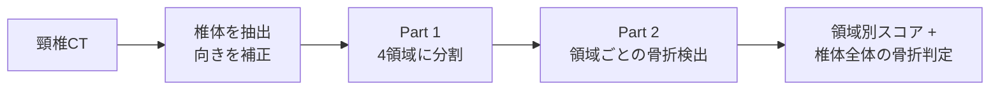

# 頸椎骨折の「領域別」検出 — 研究サマリ

> 2026-08-06 時点。頸椎を解剖学的4領域に分け、領域ごとに骨折を検出する。

## 背景と目的

頸椎骨折では「あるか / ないか」だけでなく **どの部位に及んでいるか** が臨床的に重要である。
とくに椎骨動脈が走行する **横突孔** への骨折波及は、椎骨動脈損傷リスクの判断材料になる。
既存の骨折検出AIの多くは患者単位・椎体単位の有無判定にとどまり、局在を示せない。

そこで、頸椎CTから椎体を4領域に自動分割し、**領域ごとに骨折を検出するモデル**を作る。

**4領域**: ① 椎体 ② 右横突孔周辺 ③ 左横突孔周辺 ④ 後方要素

---

## 全体の流れ

---

## Part 1: 解剖学的4領域の分割

領域を直接セグメンテーションするのではなく、**4本の解剖学的境界線を推定して椎体マスクを切る**。
領域の形は椎体マスクが決めるので、学習させるのは線の位置と向きだけで済む。

| 項目 | 内容 |
|---|---|
| 入力 | 椎体を切り出した断面CT + 椎体マスク（224×224） |
| 学習 | 4本の境界線を heatmap 回帰する軽量U-Net（5-fold） |
| 教師 | 手動で線を引いた **41症例 / 約1,600断面** |
| 領域化 | 4直線の半平面の組み合わせで椎体マスクを4分割 |
| z方向 | 推定した境界面を距離場で補間し、椎体の全断面へ伝播 |

**現状の精度**（前後2枚を併用する2.5D版、fold0 のテスト）:
角度誤差 **4.60°** / 位置誤差 **3.27 px**。単一断面版とほぼ同等で、まだ明確な改善は出ていない。

**取り組み中の課題**

- 断面間で線がばらつく → 隣接断面の角度・位置に整合性の制約をかけて抑える
- 3D化（4本線を「平面」として扱い、角度・重心位置・z方向の傾きの3パラメータで表現）を並行して試作。
  角度と位置は学習できたが、**傾きだけが過学習**（学習側は下がるが検証側は悪化）。
  信頼できる傾きの教師が1foldあたり150面程度しかないためで、モデル構造から見直し中。

---

## Part 2: 領域ごとの骨折検出

### タスク

椎体1個につき、4領域それぞれの骨折あり/なしを予測する（4ラベル同時）。

**提案手法**: 領域ごとの検出モデルを作り、それらを統合するアーキテクチャ。

比較する構成:

1. **ベースライン** — CT + 椎体全体マスク → 椎体単位の骨折判定
2. **単一領域** — CT + その領域のマスク → その領域の骨折判定
3. **統合（本命）** — 4つの領域別モデルを統合し、4領域すべてを予測

入力は 2.5D（1椎体あたり15断面 × 各5ch、面内0.4mm / FOV 89.6mm）。
マスクは入力チャンネルとして与える。**マスク平均プーリングは使わない**（領域の外の情報を捨てすぎるため）。

### データ規模

| ラベル | 数 |
|---|---|
| 椎体レベルの骨折有無 | **14,133椎体**（陽性 1,444 = 10.2%） |
| 領域ラベル（4領域の内訳） | **268椎体 / 160症例**（すべて骨折陽性） |
| 　内訳 | 椎体 77 / 右横突孔 59 / 左横突孔 71 / 後方要素 155 |

領域ラベルは専門家の負担が大きく **268で打ち止め**。この非対称性が評価設計を決めている。

### 評価の設計（重要）

領域ラベルが268しかないため、**何を「証明」できるかを分けて考える**。

| 指標 | 母集団 | 位置づけ |
|---|---|---|
| 椎体レベル AUROC | 14,133椎体 | **確証的**。手法間の優劣はここで判定（検出可能差 0.007〜0.012） |
| 領域別 AP（4領域個別） | 268椎体 | 領域ごとの絶対精度を報告 + 「近道の床」超えを事前登録ゲートとして判定 |
| 左右判別精度 | 94椎体 | 左右を取り違えていないかの単群チェック |
| 領域レベルの手法間比較 | 268椎体 | **探索的**。差が出なければ「検出できず」と書く |

**「近道の床」**: 椎体レベル（C1〜C7のどこか）だけから予測しても、
領域別APは 椎体 0.51 / 右横突孔 0.26 / 左横突孔 0.36 / 後方要素 0.67 出てしまう。
画像を見る意味を主張するには、それぞれ **0.59 / 0.37 / 0.45 / 0.72** を超える必要がある。

> 直感と逆になる点: 右横突孔は陽性が最も少ない（59）が、レベルの手がかりがほぼ効かないので
> **証明は最も易しい**。後方要素は陽性最多（155）だが床が高く、価値を示すのが最も難しい。

---

## 現在の状況

| | 状態 |
|---|---|
| Part 1 領域分割 | 動作するパイプラインは完成し、公開データ全体に適用済み。精度改善を継続中 |
| Part 2 骨折検出 | 設計・評価プロトコルを確定。**実装はこれから** |

### 次にやること

1. 領域分割の幾何制約ありなしを同一分割で比較し、効果が確認できた設定だけ5-foldへ展開
2. 3D平面版の傾き過学習に対して、モデル構造・正則化を見直す
3. 骨折検出モデルの実装（4領域モデルの統合方法と、断面枚数の決定が主な論点）

### 補足: 方針転換の記録

当初は「椎体単位の骨折ラベルだけを使う弱ラベル学習」で領域別スコアを出す設計だったが、
2026-08-04 に **領域ラベル268件を使う教師あり学習**へ切り替えた。
領域ラベルの推定（擬似ラベル等）は、まず教師ありで成立させてから後段の課題として扱う。
